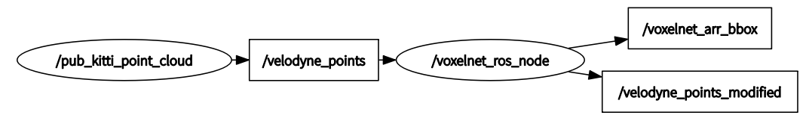
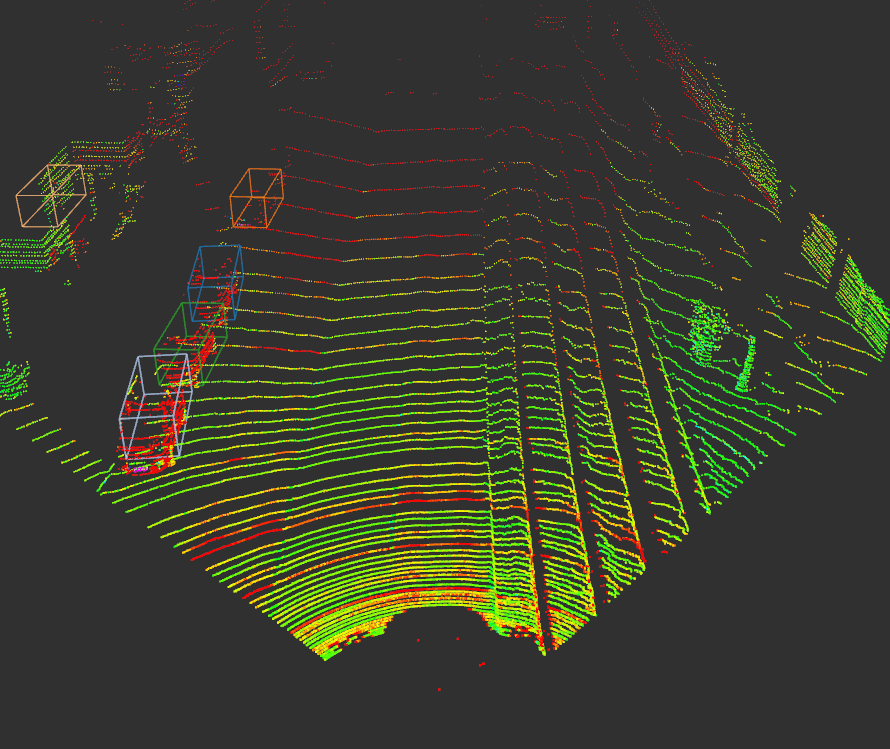
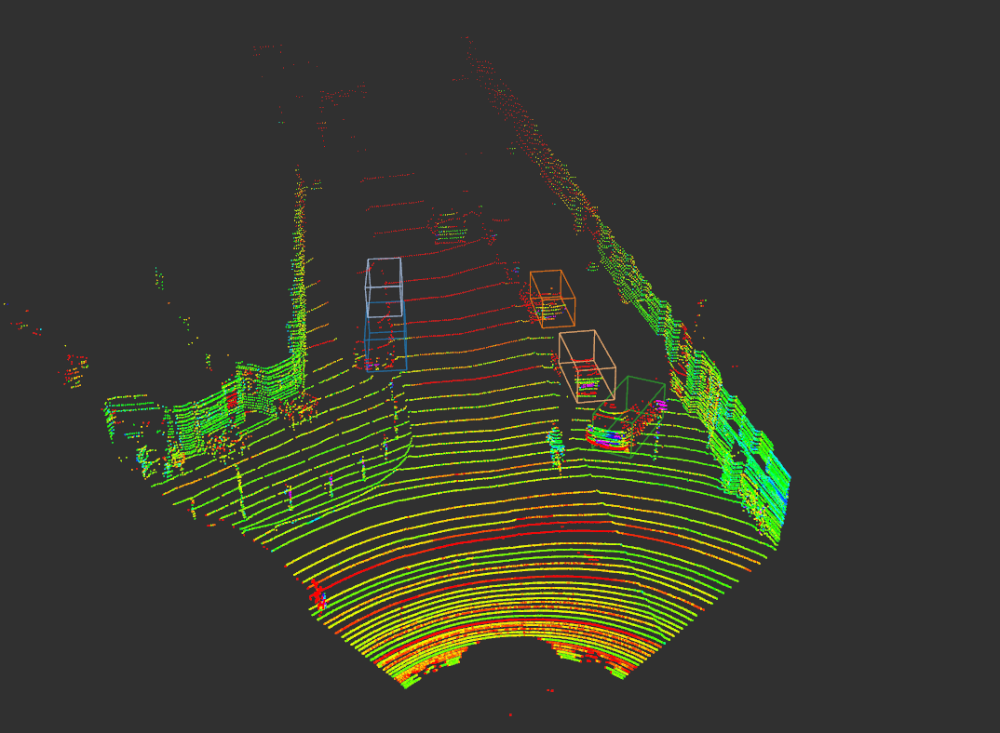
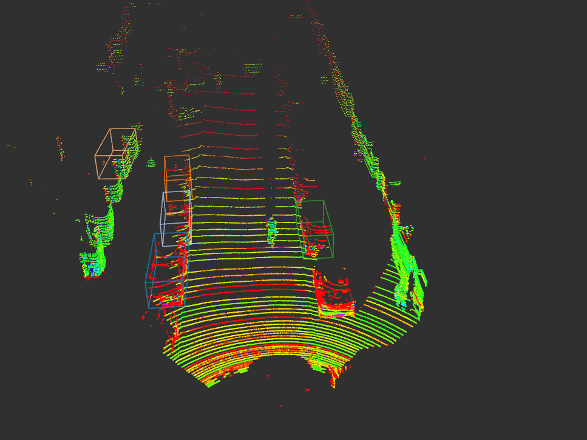

## Voxelnet ROS Implementation 
----
VoxelNet Implementation codes from "https://github.com/qianguih/voxelnet"

### Dependencies
* python3.5+
* TensorFlow (tested on 1.4)
* opencv
* shapely
* numba
* easydict
* ROS
* jsk package
  
### Data Preparation
Download the test data: https://pan.baidu.com/s/1kxZxrjGHDmTt-9QRMd_kOA

unzip to `data` folder,Directory structure should be:

```
data
----lidar_2d
--------0000...1.npy
--------0000...2.npy
--------.......
```
### Instructions
before run the code, you may need to install:


- clone this repository
- move voxelnet_ros folder to your `catkin_ws`
- `catkin_make`
- `roscd voxelnet/script/`
- `python3 voxelnet_ros.py & python3 pub_kitti_point_cloud.py` 
  - unfortunately, `rosrun` won't work. because it's using Python 3.x instead of 2.x
  
### ROS Node 



### Rviz Animation





### Future Work
- Retrain the model
- Still too slow, need more efficient implementation for the VoxelNet
- code clean